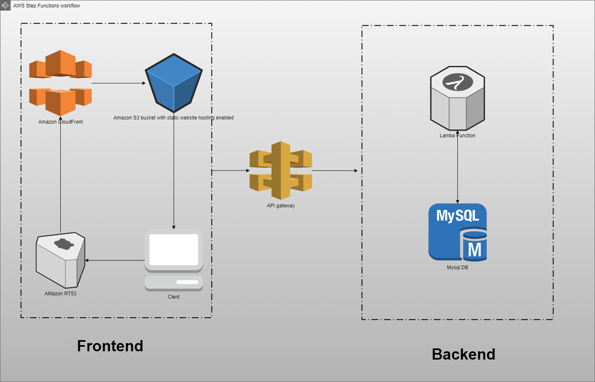

### Problem Statement:

You have a web application that accepts requests from the internet. Clients can send requests to query for data. When a request comes in, the web application queries a MySQL database and returns the data to the client.

### Solution:

Architecture Diagram:
 

### Explanation:

    The architecture diagram shows a three-tier architecture that follows AWS best practices by using services such as Amazon Virtual Private Cloud (Amazon VPC), Amazon Elastic Compute Cloud (Amazon EC2), Amazon Relational Database Service (Amazon RDS) with high availability, and Elastic Load Balancing (ELB). The architecture diagram lays out the design, including the networking layer, compute layer, database layer, and anything else that’s needed to accurately depict the architecture. The explanation describes how traffic flows through the different AWS components—from the client to the backend database, and back to the client.

### Frontend:

    - Client :  The client is a web browser that sends requests to the web application. The client can be a desktop browser, a mobile browser, or a web crawler. The client can be located anywhere in the world.

    - Amazon RT53: Amazon Route 53 is a highly available and scalable cloud Domain Name System (DNS) web service. It is designed to give developers and businesses an extremely reliable and cost effective way to route end users to Internet applications by translating names like www.example.com into the numeric IP addresses like

    - Amazon CloudFront: Amazon CloudFront is a content delivery network (CDN) service that securely delivers data, videos, applications, and APIs to customers globally with low latency, high transfer speeds, all within a developer friendly environment.

    -Amazon S3 : Amazon Simple Storage Service (Amazon S3) is an object storage service that offers industry-leading scalability, data availability, security, and performance. This means customers of all sizes and industries can use it to store and protect any amount of data for a range of use cases, such as websites, mobile applications, backup and restore, archive, enterprise applications, IoT devices, and big data analytics.

### API :

    API Gateway: Amazon API Gateway is a fully managed service that makes it easy for developers to create, publish, maintain, monitor, and secure APIs at any scale. With a few clicks in the AWS Management Console, you can create an API that acts as a “front door” for applications to access data, business logic, or functionality from your back-end services, such as workloads running on Amazon Elastic Compute Cloud (Amazon EC2), code running on AWS Lambda, or any web application.

### Backend:

    - Amazon VPC: Amazon Virtual Private Cloud (Amazon VPC) enables you to launch AWS resources into a virtual network that you've defined. This virtual network closely resembles a traditional network that you'd operate in your own data center, with the benefits of using the scalable infrastructure of AWS.

    - Amazon EC2: Amazon Elastic Compute Cloud (Amazon EC2) is a web service that provides secure, resizable compute capacity in the cloud. It is designed to make web-scale cloud computing easier for developers.

    - Amazon RDS: Amazon Relational Database Service (Amazon RDS) is a web service that makes it easier to set up, operate, and scale a relational database in the cloud. It provides cost-efficient, resizable capacity for an industry-standard relational database and manages common database administration tasks, freeing up developers to focus on what makes their applications and businesses unique.

    Lambda: AWS Lambda is a compute service that lets you run code without provisioning or managing servers. AWS Lambda executes your code only when needed and scales automatically, from a few requests per day to thousands per second. You pay only for the compute time you consume - there is no charge when your code is not running.

    DynamoDB: Amazon DynamoDB is a key-value and document database that delivers single-digit millisecond performance at any scale. It's a fully managed, multiregion, multimaster, durable database with built-in security, backup and restore, and in-memory caching for internet-scale applications.
